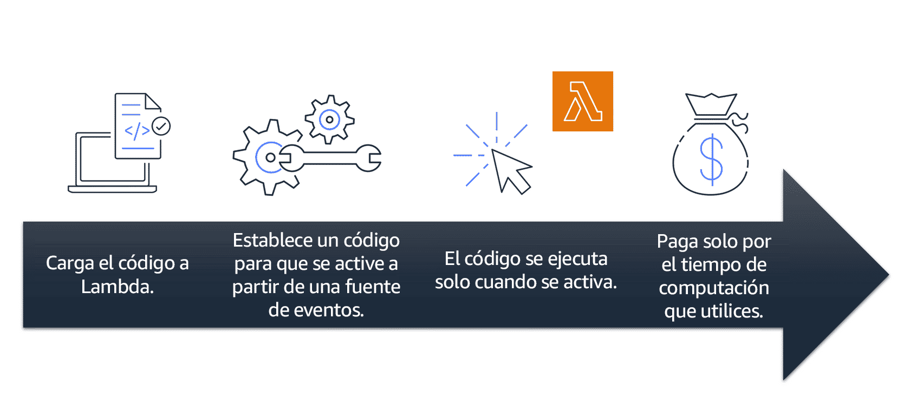
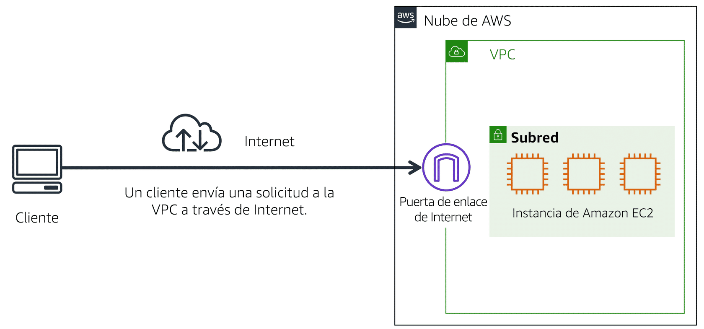
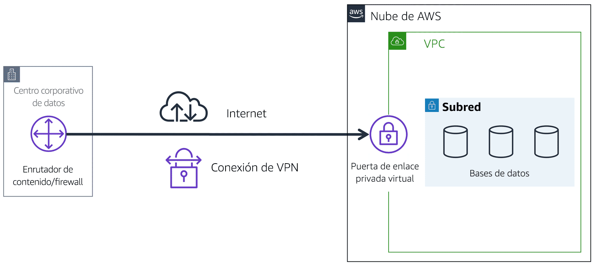
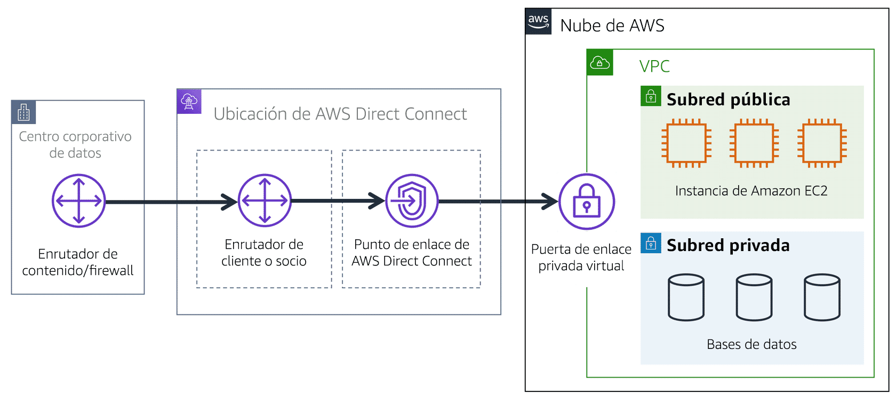
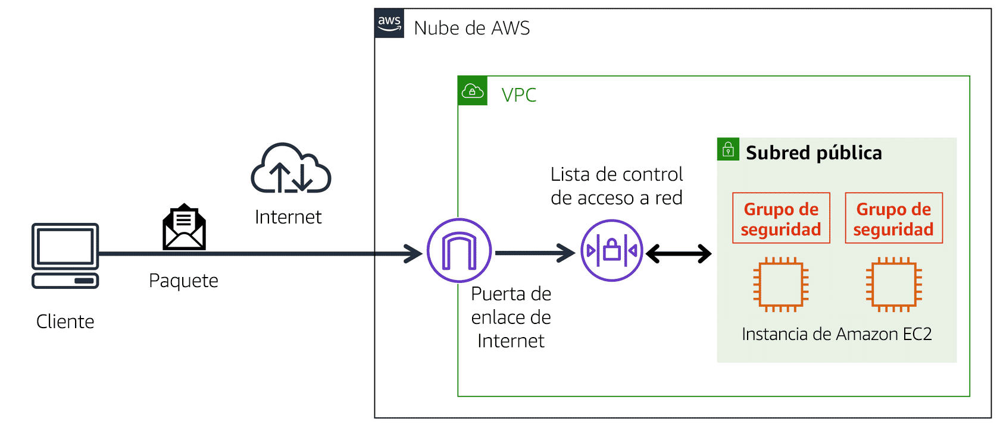

##### Módulo 1: Introducción a Amazon Web Services

- Resumir los beneficios de AWS.
- Describir las diferencias entre la entrega bajo demanda y las implementaciones en la nube.
- Resumir el modelo de precios de pago por uso.

  

##### Módulo 2: Computación en la nube

- Describir los beneficios de Amazon Elastic Compute Cloud (Amazon EC2) a nivel básico.
- Identificar los distintos tipos de instancias de Amazon EC2.
- Diferenciar entre las distintas opciones de facturación de Amazon EC2.
- Describir los beneficios de Amazon EC2 Auto Scaling.
- Resumir los beneficios de Elastic Load Balancing.
- Proporcionar un ejemplo de los usos de Elastic Load Balancing.
- Resumir las diferencias entre Amazon Simple Notification Service (Amazon SNS) y Amazon Simple Queue Services (Amazon SQS).
- Resumir las opciones de computación adicionales de AWS.

  

##### Módulo 3: Infraestructura global y fiabilidad

- Resumir los beneficios de la infraestructura global de AWS.
- Describir el concepto básico de zonas de disponibilidad.
- Describir los beneficios de las ubicaciones perimetrales y Amazon CloudFront.
- Comparar diferentes métodos para aprovisionar servicios de AWS.

  

##### Módulo 4: Redes

- Describir los conceptos básicos de redes.
- Describir la diferencia entre los recursos de redes públicas y privadas.
- Explicar una gateway privada virtual utilizando una situación real.
- Explicar una red privada virtual (VPN) utilizando una situación real.
- Describir los beneficios de AWS Direct Connect.
- Describir los beneficios de las implementaciones híbridas.
- Describir las capas de seguridad utilizadas en una estrategia de TI.
- Describir qué servicios se utilizan para interactuar con la red global de AWS.

  

##### Módulo 5: Almacenamiento y bases de datos

- Resumir el concepto básico de almacenamiento de información y bases de datos.
- Describir los beneficios de Amazon Elastic Block Store (Amazon EBS).
- Describir los beneficios de Amazon Simple Storage Service (Amazon S3).
- Describir los beneficios de Amazon Elastic File System (Amazon EFS).
- Resumir distintas soluciones de almacenamiento.
- Describir los beneficios de Amazon Relational Database Service (Amazon RDS).
- Describir los beneficios de Amazon DynamoDB.
- Resumir distintos servicios de bases de datos.

  

##### Módulo 6: Seguridad

- Explicar los beneficios del modelo de responsabilidad compartida.
- Describir la autenticación multifactor (MFA).
- Diferenciar entre los niveles de seguridad de AWS Identity and Access Management (IAM).
- Describir las políticas de seguridad a nivel básico.
- Explicar los beneficios de AWS Organizations.
- Resumir los beneficios de conformidad de AWS.
- Explicar de los servicios de seguridad principales de AWS a nivel básico.

  

##### Módulo 7: Seguimiento y análisis

- Resumir los enfoques para supervisar el entorno de AWS.
- Describir los beneficios de Amazon CloudWatch.
- Describir los beneficios de AWS CloudTrail.
- Describir los beneficios de AWS Trusted Advisor.

  

##### Módulo 8: Precios y soporte

- Comprender los modelos de soporte y precios de AWS.
- Describir el nivel gratuito de AWS.
- Describir los principales beneficios de AWS Organizations y la facturación unificada.
- Explicar los beneficios de AWS Budgets.
- Explicar los beneficios de AWS Cost Explorer.
- Explicar los principales beneficios de la calculadora de precios de AWS.
- Distinguir entre los distintos planes de AWS Support.
- Describir los beneficios de AWS Marketplace.

  

##### Módulo 9: Migración e innovación

- Comprender la migración y la innovación en la nube de AWS.
- Resumir el AWS Cloud Adoption Framework (AWS CAF).
    
- Resumir seis factores clave de una estrategia de migración a la nube.
    
- Describir los beneficios de varias soluciones de migración de datos de AWS, como AWS Snowcone, AWS Snowball o AWS Snowmobile.
    
- Resumir el amplio alcance de las soluciones innovadoras que ofrece AWS.
    

  

##### Módulo 10: El cambio a la nube

- Resumir los cinco pilares del marco de referencia AWS Well-Architected.
- Explicar los seis beneficios de la informática en la nube.

  

##### Módulo 11: Conceptos básicos de AWS Certified Cloud Practitioner

- Determinar los recursos para la preparación del examen de AWS Certified Cloud Practitioner.
- Describir los beneficios de contar con una certificación de AWS.

![[Pasted image 20231014175148.png]]

# Informática en la nube
La informática en la nube es la entrega bajo demanda de recursos de TI a través de internet con precios de pago por uso.

Se te brindaran los servicios cuando los necesites


Con AWS la idea es soportar el trabajo pesado de IT

---
## Modelos de implementación para informática en la nube

## Basada en la nube

- Lanza toda la aplicación y sus partes en la nube
- Diseña y crea en la nube

En un modelo de **implementación basado en la nube**, puedes migrar aplicaciones existentes a la nube o diseñar y crear nuevas aplicaciones directamente allí. Puedes crearlas en una infraestructura de bajo nivel que requiera que el personal de TI las administre. Otra posibilidad es crearlas utilizando servicios de nivel superior que reduzcan los requisitos de administración, arquitectura y escalado de la infraestructura principal.

Por ejemplo, una empresa podría crear una aplicación compuesta por servidores virtuales, bases de datos y componentes de red que estén completamente basados en la nube.

## Basada en instalaciones

- Implementa recursos mediante herramientas de virtualización y administración de recursos
- Es conocida como la red privada
- 


## Híbrida


Elastic Load Balancing.


Tenencia múltiple: uso compartido del hardware subyacente entre VMs


# Amazon EC2.
https://es.wikipedia.org/wiki/Amazon_EC2

## Tipos de instancia EC2

![[Pasted image 20231015123552.png]]

### Propósito general
tiene un equilibrio de lo que se encargan especificamente las otras instacias

Recursos de apps
computacion
Servicios web
Load balancer
bases de datos medianas

**Las instancias de propósito general** proporcionan un equilibrio entre recursos de computación, memoria y redes. Puedes utilizarlas para diversas cargas de trabajo, tales como:

- Servidores de aplicaciones.
- Servidores de juegos.
- Servidores de backend de aplicaciones para empresas.
- Bases de datos pequeñas y medianas.

Supongamos que tienes una aplicación en la que las necesidades de recursos para la computación, memoria y redes son aproximadamente equivalentes. Puedes decidir iniciarla en una instancia de propósito general porque la aplicación no requiere optimización en ningún área de recursos única.

### de computo optimizada
alta carga de computacion en tareas
computacion de alto rendimiento HPC
Juegos

**Las instancias de computación optimizada** son ideales para aplicaciones vinculadas a la computación que se benefician de procesadores de alto rendimiento. Al igual que las instancias de propósito general, puedes utilizar instancias de computación optimizada para cargas de trabajo como servidores web, aplicaciones o juegos.  
  
Sin embargo, la diferencia es que las aplicaciones de computación optimizada son ideales para servidores web de alto rendimiento, servidores de aplicaciones de uso intensivo de computación y servidores de juegos dedicados. También puedes utilizar este tipo de instancias para cargas de trabajo de procesamiento por lotes que requieran procesar muchas transacciones en un solo grupo.


### instancia de computacion acelerada

**Las instancias de computación acelerada** utilizan aceleradores de hardware o coprocesadores para realizar algunas funciones de la forma más eficiente posible en el software que se inicia en las CPU. Algunos ejemplos de estas funciones incluyen cálculos con números de coma flotante, procesamiento de gráficos y coincidencia de patrones de datos.  
  

En informática, un acelerador de hardware es un componente que puede acelerar el procesamiento de datos. Las instancias de computación acelerada son ideales para cargas de trabajo como aplicaciones gráficas, streaming de juegos y streaming de aplicaciones.

### memoria optimizada
alta carga de memoria
graficos
aceleradores de harware

**Las instancias optimizadas de memoria** están diseñadas para ofrecer un rendimiento rápido para cargas de trabajo que procesan grandes conjuntos de datos en la memoria. En computación, la memoria es un área de almacenamiento temporal. Contiene todos los datos e instrucciones que necesita una unidad central de procesamiento (CPU) para poder completar acciones. Para poder iniciar un programa o una aplicación de ordenador, debe cargarse desde el almacenamiento a la memoria. Este proceso de precarga proporciona a la CPU acceso directo al programa informático.


Supongamos que tienes una carga de trabajo que requiere que se carguen previamente grandes cantidades de datos antes de iniciar una aplicación. En este escenario, puede tratarse de una base de datos de alto rendimiento o de una carga de trabajo que implique procesar en tiempo real una gran cantidad de datos no estructurados. En este tipo de casos prácticos, considera la posibilidad de utilizar una instancia optimizada de memoria. Estas permiten llevar a cabo cargas de trabajo con altas necesidades de memoria y obtener un excelente rendimiento.
### optimizadas para almacenamiento
alta carga de datos locales

**Las instancias optimizadas para el almacenamiento** están diseñadas para cargas de trabajo que requieren acceso de lectura y escritura alto y secuencial a grandes conjuntos de datos en el almacenamiento local. Algunos ejemplos de cargas de trabajo adecuadas para este tipo de instancias incluyen sistemas de archivos distribuidos, aplicaciones de data warehousing y sistemas de procesamiento de transacciones en línea de alta frecuencia (OLTP).  
  

En informática, el término operaciones de entrada/salida por segundo (IOPS) es una métrica que mide el rendimiento de un dispositivo de almacenamiento. Indica cuántas operaciones de entrada o salida diferentes puede realizar un dispositivo en un segundo. Las instancias optimizadas para el almacenamiento están diseñadas para ofrecer decenas de miles de IOPS aleatorias y de baja latencia a las aplicaciones. 

  

Puede pensar en las operaciones de entrada como datos introducidos en un sistema, como los registros introducidos en una base de datos. Una operación de salida son datos generados por un servidor. Un ejemplo de salida podría ser el análisis realizado en los registros de una base de datos. Si tiene una aplicación que tiene un alto requisito de IOPS, una instancia optimizada para el almacenamiento puede proporcionar un mejor rendimiento en comparación con otros tipos de instancias no optimizadas para este tipo de caso práctico.


## Precios de EC2


### bajo demanda
suelen ser costos por tiempo de uso computacional (sale mas caro y se usa regularmente para testeo de apps y desarrollo mas no produccion)

Las **instancias bajo demanda** son ideales para cargas de trabajo irregulares a corto plazo que no se pueden interrumpir. No se aplican costes iniciales ni contratos mínimos. Las instancias se inician continuamente hasta que las detienes y solo pagas por el tiempo de computación que usas.  
  
Algunos ejemplos de casos prácticos para instancias bajo demanda incluyen el desarrollo y la prueba de aplicaciones, y el arranque de aplicaciones que tienen patrones de uso impredecibles. Las instancias bajo demanda no se recomiendan para cargas de trabajo que duran un año o más porque estas cargas de trabajo pueden experimentar un mayor ahorro de costes mediante instancias reservadas.

### planes de ahorro

AWS ofrece planes de ahorro para varios servicios de computación, incluido Amazon EC2. **Los planes de ahorro de Amazon EC2** te permiten reducir los costes de computación si te comprometes a un uso de computación constante durante un periodo de 1 o 3 años. El compromiso durante este periodo se traduce en un ahorro de hasta un 72 % en comparación con los costes bajo demanda.  
  

Cualquier uso que no supere el compromiso se cobra según la tarifa del plan de ahorro con descuento (por ejemplo, 10 USD la hora). El uso que supere el compromiso se cobra según las tarifas bajo demanda habituales.  
  

Más adelante en el curso, verás AWS Cost Explorer, una herramienta que te permitirá visualizar, comprender y administrar los costes y el uso de AWS a lo largo del tiempo. Si estás barajando opciones de planes de ahorro, AWS Cost Explorer puede analizar tu uso de Amazon EC2 durante los últimos 7, 30 o 60 días. AWS Cost Explorer también ofrece recomendaciones personalizadas para planes de ahorro. Estas recomendaciones realizan una estimación de cuánto podrías ahorrar en los costes mensuales de Amazon EC2, según el uso previo de Amazon EC2 y el importe del compromiso por hora en un plan de ahorro de 1 o 3 años.

### instancias reservadas
Las **instancias reservadas** son un descuento de facturación que se aplica al uso de instancias bajo demanda en tu cuenta. Puedes comprar instancias reservadas estándar y convertibles para un periodo de 1 o 3 años, e instancias reservadas programadas para un periodo de 1 año. Lograrás un mayor ahorro de costes con la opción de 3 años.


Al final de un periodo de instancia reservada, puedes seguir utilizando la instancia de Amazon EC2 sin interrupción. Sin embargo, se te cobrarán tarifas bajo demanda hasta que realices una de las siguientes acciones:

- Terminar la instancia.
- Adquirir una nueva instancia reservada que coincida con los atributos de instancia (tipo de instancia, región, tenencia y plataforma).


### instancias spot

(tiene definido el ciclo de inicio-fin)

- la spot  utiliza las instancias no usadas de ec2 lo que dificulta su disponibilidad y estan sjetas a interrupiones

Las **instancias de spot** son ideales para cargas de trabajo con horarios de inicio y fin flexibles, o que pueden soportar interrupciones. Estas instancias utilizan la capacidad de computación de Amazon EC2 no utilizada y ofrecen ahorro de costes con hasta un 90 % de descuento en los precios bajo demanda.  
  
Supongamos que tienes un trabajo de procesamiento en segundo plano que puede iniciarse y detenerse según sea necesario (como el trabajo de procesamiento de datos de una encuesta de clientes). Lo deseable es iniciar y detener el trabajo de procesamiento sin que afecte a las operaciones generales de la empresa. Si realizas una petición de spot y la capacidad de Amazon EC2 está disponible, se lanzará la instancia de spot. Sin embargo, si realizas una petición de spot y la capacidad de Amazon EC2 no está disponible, la petición no se realizará correctamente hasta que la capacidad esté disponible. La capacidad no disponible puede retrasar el lanzamiento del trabajo de procesamiento en segundo plano.  
  
Después de lanzar una instancia de spot, si la capacidad ya no está disponible o aumenta la demanda de dichas instancias, es posible que la instancia se interrumpa. Puede que esto no suponga ningún problema para el trabajo de procesamiento en segundo plano. Sin embargo, en el ejemplo anterior de desarrollo y prueba de aplicaciones, lo más probable es que desees evitar interrupciones inesperadas. Por lo tanto, elige otro tipo de instancia EC2 más adecuado para esas tareas.


### hosts dedicados

**Los hosts dedicados** son servidores físicos con capacidad de instancias de Amazon EC2 totalmente dedicada a su uso. 

Puedes utilizar las licencias de software existentes por socket, por núcleo o por VM para ayudar a mantener la conformidad de las licencias. Puedes comprar reservas de hosts dedicados y hosts dedicados bajo demanda. De todas las opciones de Amazon EC2 cubiertas, los hosts dedicados son los más caros.


# Amazon EC2 Auto Scaling
## Capacidad y elasticidad 

![[Pasted image 20231015132523.png]]

<aside></aside>
<aside>Amazon EC2 Auto Scaling te permite agregar o eliminar automáticamente instancias de Amazon EC2 en respuesta a la demanda cambiante de las aplicaciones. Al escalar automáticamente las instancias horizontal y verticalmente según sea necesario, puedes mantener una mayor sensación de disponibilidad de las aplicaciones.

En Amazon EC2 Auto Scaling, puedes utilizar dos estrategias: escalado dinámico y escalado predictivo.

- _El escalado dinámico_ responde a la demanda cambiante. 
- El _escalado predictivo_ programa automáticamente el número correcto de instancias de Amazon EC2 en función de la demanda prevista.</s>

## escalado vertical y horizontal

crea instancias y detiene las instancias segun sea la demanda y capacidad no usada


### vertical 

- agregar potencia de maquinas en uso
- aprovisionar el exceso
- dedica la potencia para el proceso que come mas recurso
- 


![[Pasted image 20231015135746.png]]

> [!WARNIGN]
> Si no especificas el número deseado de instancias de Amazon EC2 en un grupo de Auto Scaling, la capacidad deseada se establece de forma predeterminada en su capacidad mínima.


Es importante establecer las instancias maximas a usar cuando haya demanda

# Dirección de tráfico con Elastic Load Balancing

definir que las instancias tengan funciones diferentes
- LB es un intermediario para distribuir correctamente el trafico
- es regional, lo que significa es cuenta con alta disponibilidad para la infraestructura global, ya que no se aplica individualmente a instancias

![[Pasted image 20231015151157.png]]


# Mensajeria y colas


buffer


La comunicación entre aplicaciones directamente se llama acoplamiento ajustado.


La mensajería puede ser síncrona (donde las partes esperan una respuesta inmediata) o asíncrona (donde las partes pueden continuar trabajando sin esperar una respuesta inmediata).
## arquitectura monolitica

![[Pasted image 20231015154818.png]]

Las aplicaciones están formadas de varios componentes. Los componentes se comunican entre sí para transmitir datos, satisfacer solicitudes y mantener la aplicación en uso. 

Supongamos que tienes una aplicación con componentes estrechamente acoplados. Estos componentes pueden incluir bases de datos, servidores, interfaz de usuario, lógica empresarial, etc. Este tipo de arquitectura puede considerarse una **aplicación monolítica**. 

En esta estrategia de arquitectura de aplicaciones, si falla un componente, otros componentes fallan y, probablemente, toda la aplicación fallará.
## microservicios

![[Pasted image 20231015154828.png]]

En una estrategia de microservicios, los componentes de la aplicación están acoplados débilmente. En este caso, si falla un solo componente, los demás componentes siguen funcionando porque están comunicados entre sí. El acoplamiento débil evita que toda la aplicación falle. 

Cuando diseñes aplicaciones en AWS, puedes adoptar la estrategia de microservicios con servicios y componentes que cumplan diferentes funciones. Dos servicios facilitan la integración de aplicaciones: Amazon Simple Notification Service (Amazon SNS) y Amazon Simple Queue Service (Amazon SQS).

## **Amazon Simple Queue Service (Amazon SQS)** 

es un servicio de cola de mensajes entre los componentes de software 

Con Amazon SQS, puedes enviar, almacenar y recibir mensajes entre componentes de software, sin perder mensajes y sin necesidad de que otros servicios estén disponibles. En Amazon SQS, una aplicación envía mensajes a una cola. Un usuario o un servicio extrae un mensaje de la cola, lo procesa y, a continuación, lo elimina de la cola.


# Sin servidor 

El término "sin servidor" significa que el código se inicia en servidores, pero no es necesario aprovisionar ni administrar dichos servidores. Con la computación sin servidor, puedes centrarte más en innovar con productos y características nuevas, y no en el mantenimiento de los servidores.

Otro beneficio es la flexibilidad de escalar aplicaciones sin servidor automáticamente. La computación sin servidor puede ajustar la capacidad de las aplicaciones modificando las unidades de consumo, como el rendimiento y la memoria. 

Un servicio de AWS para la computación sin servidor es **AWS Lambda**.

## AWS Lambda
desecadenador = trigger (es un evento que inicia la ejecución de una función Lambda.)
![[Pasted image 20231015164513.png]]
[**AWS Lambda**](https://aws.amazon.com/lambda) es un servicio que permite iniciar código sin necesidad de aprovisionar ni administrar servidores. 

Cuando se utiliza AWS Lambda, solo se paga por el tiempo de computación que se consume. Los cargos solo se aplican cuando el código está en funcionamiento. También se puede iniciar código para prácticamente cualquier tipo de aplicación o servicio backend, todo sin necesidad de administración. 

Por ejemplo, una función Lambda sencilla podría implicar cambiar automáticamente el tamaño de las imágenes cargadas en la nube de AWS. En este caso, la función se activa cuando se carga una nueva imagen.



# Containers

**Los contenedores** proporcionan una forma estándar de empaquetar el código y las dependencias de tu aplicación en un solo objeto. También puedes utilizarlos para procesos y flujos de trabajo en los que existan requisitos esenciales de seguridad, fiabilidad y escalabilidad.


## Amazon Elastic Container Service (Amazon ECS)
[**Amazon Elastic Container Service (Amazon ECS)**](https://aws.amazon.com/ecs/) es un sistema de administración de contenedores altamente escalable y de alto rendimiento que permite lanzar y escalar aplicaciones en contenedores en AWS. 

Amazon ECS admite contenedores Docker. [Docker](https://www.docker.com/) es una plataforma de software que permite crear, probar e implementar aplicaciones rápidamente. AWS admite el uso de Docker Community Edition (de código abierto) y Docker Enterprise Edition (de suscripción). Con Amazon ECS, puedes utilizar las llamadas a la API para lanzar y detener aplicaciones habilitadas para Docker.


# Amazon Elastic Kubernetes Service (Amazon _EKS_)

[**Amazon Elastic Kubernetes Service (Amazon EKS)**](https://aws.amazon.com/eks/) es un servicio totalmente administrado que se puede utilizar para lanzar Kubernetes en AWS. 

[Kubernetes](https://kubernetes.io/) es un software de código abierto que permite implementar y administrar aplicaciones en contenedores a escala. Una gran comunidad de voluntarios mantiene Kubernetes y AWS colabora activamente en dicha comunidad. A medida que se publican nuevas características y funcionalidades para las aplicaciones de Kubernetes, se pueden aplicar fácilmente estas actualizaciones a las aplicaciones administradas por Amazon EKS.


# AWS Fargate

[**AWS Fargate**](https://aws.amazon.com/fargate/) es un motor de computación sin servidor para contenedores. Funciona tanto con Amazon ECS como con Amazon EKS. 

Con AWS Fargate no es necesario aprovisionar ni administrar servidores. AWS Fargate administra la infraestructura de servidores por ti. Puedes centrarte más en innovar y desarrollar tus aplicaciones y solo pagarás por los recursos necesarios para lanzar tus contenedores.

## 

**Recursos adicionales**

Para más información sobre los conceptos que se han tratado en el módulo 2, revisa estos recursos.

- [Computación en AWS](https://aws.amazon.com/products/compute).
- [Blog de computación de AWS](https://aws.amazon.com/blogs/compute/).
- [Servicios de computación de AWS](https://docs.aws.amazon.com/whitepapers/latest/aws-overview/compute-services.html).
- [Tutoriales prácticos: computación](https://aws.amazon.com/getting-started/hands-on/?awsf.getting-started-category=category%23compute&awsf.getting-started-content-type=content-type%23hands-on).
- [Profundizar en la categoría: sin servidor](https://aws.amazon.com/getting-started/deep-dive-serverless/).
- [Historias de clientes de AWS: sin servidor](https://aws.amazon.com/solutions/case-studies/?customer-references-cards.sort-by=item.additionalFields.publishedDate&customer-references-cards.sort-order=desc&awsf.customer-references-location=*all&awsf.customer-references-segment=*all&awsf.customer-references-product=product%23vpc%7Cproduct%23api-gateway%7Cproduct%23cloudfront%7Cproduct%23route53%7Cproduct%23directconnect%7Cproduct%23elb&awsf.customer-references-category=category%23serverless).

# Infraestructura global de AWS

Latencia: tiempo que se toma en enviarse y recibir los datos


## Proximidad a los clientes

Seleccionar una región cercana a tus clientes te ayudará a enviarles contenido más rápido. Por ejemplo, tu empresa tiene sede en Washington, DC, y muchos de tus clientes viven en Singapur. Puedes considerar la posibilidad de ejecutar tu infraestructura en la región de Virginia del Norte para estar cerca de la sede de la empresa y ejecutar tus aplicaciones desde la región de Singapur.

## servicios disponibles en la región

A veces, es posible que la región más cercana no tenga todas las características que deseas ofrecer a los clientes. AWS innova con frecuencia creando nuevos servicios y ampliando las características de los servicios existentes. No obstante, para que los nuevos servicios puedan estar disponibles en todo el mundo, a veces es necesario que AWS desarrolle hardware físico región a región. 

Supongamos que tus desarrolladores quieren crear una aplicación que utilice Amazon Braket (plataforma de computación cuántica de AWS). En este curso, Amazon Braket aún no está disponible en todas las regiones de AWS del mundo, por lo que tus desarrolladores tendrían que ejecutarlo en una de las regiones que ya lo ofrecen.


Una **zona de disponibilidad** es un centro de datos único o un grupo de centros de datos dentro de una región. Las zonas de disponibilidad están ubicadas a decenas de kilómetros de distancia entre sí. Esto está lo suficientemente cerca como para tener baja latencia (el tiempo transcurrido entre el momento en que se solicita y se recibe el contenido) entre las zonas de disponibilidad. Sin embargo, si se produce un desastre en una parte de la región, están lo suficientemente separadas como para reducir la posibilidad de que se vean afectadas varias zonas de disponibilidad.

## # Ubicaciones perimetrales

Utiliza el cloudfront y el DNS (Amazon Route 53)


#### AWS Outposts
https://aws.amazon.com/es/outposts/
Para usar AWS en las instalaciones
## CDN
para almacenar datos en cache si no esta en la zona de disponiblidad local 

## Cómo aprovisionar recursos de AWS
modelar fácilmente los recursos de la infraestructura con código para habilitar la conformidad de la configuración y una solución de problemas más rápida.

API: Application programming interface - interfaz de programación de aplicaciones
### AWS Management Console
**AWS Management Console** es una interfaz basada en la web para acceder y administrar los servicios de AWS. Puedes acceder rápidamente a los servicios utilizados recientemente y buscar otros servicios por nombre, palabra clave o acrónimo. La consola incluye asistentes y flujos de trabajo automatizados que pueden simplificar el proceso de realización de tareas.  
  
También puedes utilizar la aplicación móvil de AWS Console para realizar tareas como supervisar recursos, ver alarmas y acceder a la información de facturación. En la aplicación móvil de AWS Management Console pueden permanecer iniciadas varias identidades al mismo tiempo.

### AWS CLI
Para ahorrar tiempo al realizar peticiones de API, puedes utilizar **AWS Command Line Interface (AWS CLI)**. AWS CLI te permite controlar varios servicios de AWS directamente desde la línea de comando en una herramienta. AWS CLI está disponible para los usuarios en Windows, macOS y Linux. 

Mediante AWS CLI, puedes automatizar las acciones que realizan tus servicios y aplicaciones mediante scripts. Por ejemplo, puedes utilizar comandos para lanzar una instancia de Amazon EC2, conectar una instancia de Amazon EC2 a un grupo de Auto Scaling específico y mucho más.

### SDK

Otra opción para acceder a los servicios de AWS y administrarlos son los **kits de desarrollo de software (SDK)**. Los SDK te facilitan el uso de los servicios de AWS a través de una API diseñada para tu lenguaje de programación o plataforma. Los SDK te permiten utilizar los servicios de AWS con sus aplicaciones existentes o crear aplicaciones completamente nuevas que se ejecutarán en AWS.

Para ayudarte a empezar a utilizar los SDK, AWS proporciona documentación y código de muestra para cada lenguaje de programación compatible. Entre los lenguajes de programación compatibles se incluyen C++, Java, .NET y muchos más.

## AWS Elastic Beanstalk.

## cloudformation
https://docs.aws.amazon.com/es_es/AWSCloudFormation/latest/UserGuide/Welcome.html

AWS CloudFormation es un servicio que le ayuda a modelar y configurar sus recursos de AWS, por lo que podrá dedicar menos tiempo a la administración de dichos recursos y más tiempo a centrarse en las aplicaciones que se ejecutan en AWS. Puede crear una plantilla que describa todos los recursos de AWS que desea (como instancias de Amazon EC2 o instancias de base de datos de Amazon RDS) y CloudFormation se encargará del aprovisionamiento y la configuración de dichos recursos. No es necesario crear y configurar individualmente los recursos de AWS ni averiguar qué depende de qué; CloudFormation se encarga de todo eso. Las siguientes situaciones demuestran cómo puede ayudarle CloudFormation.


Revisa estos recursos para obtener más información sobre los conceptos que se han visto en el módulo 3.

- [Infraestructura global](https://www.infrastructure.aws/).
- [Mapa interactivo de la infraestructura global de AWS](https://aws.amazon.com/about-aws/global-infrastructure/).
- [Regiones y zonas de disponibilidad](https://aws.amazon.com/about-aws/global-infrastructure/regions_az).
- [Blog de redes y entrega de contenido de AWS](https://aws.amazon.com/blogs/networking-and-content-delivery/).
- [Herramientas para crear en AWS](https://aws.amazon.com/tools/).
- [Historias de clientes de AWS: entrega de contenido](https://aws.amazon.com/solutions/case-studies/?customer-references-cards.sort-by=item.additionalFields.publishedDate&customer-references-cards.sort-order=desc&awsf.customer-references-location=*all&awsf.customer-references-segment=*all&awsf.customer-references-product=product%23vpc%7Cproduct%23api-gateway%7Cproduct%23cloudfront%7Cproduct%23route53%7Cproduct%23directconnect%7Cproduct%23elb&awsf.customer-references-category=category%23content-delivery).


# Redes 


gateway privada virtual

## **Amazon Virtual Private Cloud (Amazon VPC)**

Imagina los millones de clientes que utilizan los servicios de AWS. Además, imagina los millones de recursos que han creado dichos clientes, como las instancias de Amazon EC2. Sin límites en torno a todos estos recursos, el tráfico de red podría fluir entre ellos sin restricciones. 

Un servicio de redes que se puede utilizar para establecer límites en torno a los recursos de AWS es [**Amazon Virtual Private Cloud (Amazon VPC)**](https://aws.amazon.com/vpc/).

Amazon VPC permite aprovisionar una sección aislada de la nube de AWS. En esta sección aislada, puedes lanzar recursos en una red virtual definida. Dentro de una Virtual Private Cloud (VPC), puedes organizar los recursos en subredes. Una **subred** es una sección de una VPC que puede contener recursos como instancias de Amazon EC2.


## **Puerta de enlace de Internet**

Para permitir que el tráfico público de Internet acceda a tu VPC, debes conectar una **puerta de enlace de Internet** a la VPC.



Una puerta de enlace de Internet es una conexión entre una VPC e Internet. Podemos imaginar que es como la puerta que utilizan los clientes para entrar a la cafetería. Sin una puerta de enlace de Internet, nadie puede acceder a los recursos de tu VPC.

¿Qué ocurre si tienes una VPC que incluye solo recursos privados?

## **Puerta de enlace privada virtual**

Para acceder a los recursos privados de una VPC, puedes utilizar una **puerta de enlace privada virtual**. 

A continuación se muestra un ejemplo de cómo funciona una puerta de enlace privada virtual. Puedes imaginarte que Internet es como el camino entre tu casa y la cafetería. Supongamos que viajas por esta carretera con un guardaespaldas que te protege. Sigues utilizando la misma carretera que otros clientes, pero con una capa adicional de protección. 

El guardaespaldas es como una conexión de red privada virtual (VPN) que cifra (o protege) tu tráfico de Internet de todas las demás peticiones que lo rodean. 

La puerta de enlace privada virtual es el componente que permite que el tráfico de Internet protegido entre en la VPC. Aunque tu conexión a la cafetería tiene protección adicional, es posible que se produzcan atascos porque estás utilizando la misma carretera que otros clientes.



Una puerta de enlace privada virtual permite establecer una conexión de red privada virtual (VPN) entre la VPC y una red privada, como un centro de datos en las instalaciones o una red corporativa interna. Una puerta de enlace privada virtual permite el tráfico en la VPC solo si procede de una red aprobada.

## **AWS Direct Connect**

[**AWS Direct Connect**](https://aws.amazon.com/directconnect/) es un servicio que permite establecer una conexión privada dedicada entre un centro de datos y una VPC.  

Supongamos que hay un edificio de apartamentos con un pasillo que conecta directamente el edificio con la cafetería. Solo los residentes del edificio de apartamentos pueden utilizar este pasillo. 

Este pasillo privado proporciona el mismo tipo de conexión dedicada que AWS Direct Connect. Los residentes pueden entrar en la cafetería sin necesidad de utilizar la vía pública compartida con otros clientes.



La conexión privada que proporciona AWS Direct Connect ayuda a reducir los costes de red y aumentar la cantidad de ancho de banda que puede viajar a través de tu red.

## Subredes y listas de control de acceso a la red


### ACL


### Subredes

Una subred es una sección de una VPC en la que se pueden agrupar recursos en función de las necesidades operativas o de seguridad. Las subredes pueden ser públicas o privadas.


Las **subredes públicas** contienen recursos a los que el público debe tener acceso, como el sitio web de una tienda en línea.

Las **subredes privadas** contienen recursos a los que solo se debe tener acceso a través de la red privada, como una base de datos que contiene la información personal de los clientes y los historiales de pedidos. 

En una VPC, las subredes pueden comunicarse entre sí. Por ejemplo, podrías tener una aplicación que incluyera instancias de Amazon EC2 de una subred pública que se comunicaran con bases de datos ubicadas en una subred privada.

```text
La respuesta correcta es debes colocar las instancias de Amazon EC2 en una subred pública y las instancias de bases de datos de Amazon RDS en una subred privada.


Una subred es una sección de una VPC en la que puede agrupar recursos en función de las necesidades operativas o de seguridad. Las subredes pueden ser públicas o privadas.


Las subredes públicas contienen recursos a los que el público debe tener acceso, como el sitio web de una tienda en línea.


Las subredes privadas contienen recursos a los que solo se debe tener acceso a través de la red privada, como una base de datos que contiene la información personal de los clientes y los historiales de pedidos.


```

### Tráfico de red en una VPC

Cuando un cliente solicita datos de una aplicación alojada en la nube de AWS, su petición se envía como un paquete. Un **paquete** es una unidad de datos enviada a través de Internet o de una red. 

Entra en una VPC a través de una puerta de enlace de Internet. Antes de que un paquete pueda entrar en una subred o salir de ella, se comprueban los permisos. Estos permisos indican quién ha enviado el paquete y cómo intenta comunicarse el paquete con los recursos de una subred.

El componente de la VPC que comprueba los permisos de paquetes de subredes es una [**lista de control de acceso a la red (ACL)**](https://docs.aws.amazon.com/vpc/latest/userguide/vpc-network-acls.html).

### Listas de control de acceso a la red (ACL)

Una lista de control de acceso a la red (ACL) es un firewall virtual que controla el tráfico entrante y saliente a nivel de subred.

Cada cuenta de AWS incluye una ACL de red predeterminada. Al configurar la VPC, puedes utilizar la ACL de red predeterminada de tu cuenta o crear ACL de red personalizadas. 

De forma predeterminada, la ACL de red predeterminada de tu cuenta permite todo el tráfico entrante y saliente, pero puedes modificarlo añadiendo tus propias reglas. En el caso de las ACL de red personalizadas, todo el tráfico entrante y saliente se deniega hasta que se agregan reglas para especificar qué tráfico se va a permitir. Además, todas las ACL de red tienen una regla de denegación explícita. Esta regla garantiza que si un paquete no coincide con ninguna de las demás reglas de la lista, se deniega.


### Filtrado de paquetes sin estado

Las ACL de red realizan un filtrado de paquetes **sin estado**. No recuerdan nada y comprueban los paquetes que cruzan el borde de la subred en cada sentido: entrantes y salientes. 

Recuerda el ejemplo anterior de un viajero que quiere entrar en otro país. Esto es similar a enviar una petición desde una instancia de Amazon EC2 hacia Internet.

Cuando una respuesta del paquete para esa petición vuelve a la subred, la ACL de red no recuerda la petición anterior. La ACL de red comprueba la respuesta del paquete con su lista de reglas para determinar si se debe permitir o denegar.


Una vez que un paquete ha entrado en una subred, debe tener evaluados sus permisos para los recursos de la subred, como las instancias de Amazon EC2. 

El componente de la VPC que comprueba los permisos de paquetes de una instancia de Amazon EC2 es un [**grupo de seguridad**](https://docs.aws.amazon.com/vpc/latest/userguide/VPC_SecurityGroups.html).


## Grupos de seguridad

Un grupo de seguridad es un firewall virtual que controla el tráfico entrante y saliente de una instancia de Amazon EC2.


De forma predeterminada, un grupo de seguridad deniega todo el tráfico entrante y permite todo el tráfico saliente. Puedes agregar reglas personalizadas para configurar qué tráfico permitir o denegar.

Por ejemplo, supongamos que te encuentras en un edificio de apartamentos con un portero que recibe a los invitados en el vestíbulo. Puedes imaginarte a los invitados como paquetes y al portero como un grupo de seguridad. A medida que llegan los invitados, el portero comprueba una lista para asegurarse de que pueden entrar en el edificio. Sin embargo, el portero no vuelve a comprobar la lista cuando los invitados salen del edificio.
### Filtrado de paquetes con estado

Los grupos de seguridad realizan **un filtrado de paquetes con estado**. Recuerdan las decisiones anteriores tomadas con los paquetes entrantes.

Volvamos al ejemplo del envío de una solicitud desde una instancia de Amazon EC2 a Internet. 

Cuando una respuesta de paquete para esa petición vuelve a la instancia, el grupo de seguridad recuerda la petición anterior. El grupo de seguridad permite que la respuesta continúe, independientemente de las reglas del grupo de seguridad entrante.

Tanto las ACL de red como los grupos de seguridad permiten configurar reglas personalizadas para el tráfico de la VPC. Conforme sigues aprendiendo más sobre la seguridad y las redes de AWS, asegúrate de que tiene claras las diferencias entre las ACL de red y los grupos de seguridad.




## Redes globales

### Amazon route 53 (DNS de amazon)


## Sistema de nombres de dominio (DNS)**

Supongamos que UnaEmpresa tiene un sitio web alojado en la nube de AWS. Los clientes introducen la dirección web en su navegador y pueden acceder al sitio web. Esto ocurre debido a la resolución del **sistema de nombres de dominio (DNS)**. La resolución DNS implica que un servidor DNS se comunique con un servidor web.

Puedes pensar en DNS como la guía telefónica de Internet. La resolución DNS es el proceso de traducir un nombre de dominio a una dirección IP.


Al introducir el nombre de dominio en el navegador, esta petición se envía a un servidor DNS.

El servidor DNS solicita al servidor web la dirección IP que corresponde al sitio web de UnaEmpresa.

El servidor web responde proporcionando la dirección IP del sitio web de UnaEmpresa, 192.0.2.0.

## Amazon Route 53

[**Amazon Route 53**](https://aws.amazon.com/route53) es un servicio web DNS. Ofrece a los desarrolladores y las empresas una forma fiable de dirigir a los usuarios finales a aplicaciones de Internet alojadas en AWS. 

Amazon Route 53 conecta las peticiones de los usuarios a la infraestructura que se lanza en AWS (como instancias de Amazon EC2 y equilibradores de carga). Puede dirigir a los usuarios a la infraestructura fuera de AWS.

Otra característica de Route 53 es la capacidad de administrar los registros DNS de los nombres de dominio. Se pueden registrar nuevos nombres de dominio directamente en Route 53. También se pueden transferir registros DNS para nombres de dominio existentes administrados por otros registradores de dominio. Esto permite administrar todos los nombres de dominio en una única ubicación.

En el módulo anterior aprendiste sobre Amazon CloudFront, un servicio de entrega de contenido. En el siguiente ejemplo se describe cómo trabajan juntos Route 53 y Amazon CloudFront para entregar contenido a los clientes.


### Recursos adicionales

Para más información sobre los conceptos que se han tratado en el módulo 4, revisa estos recursos.

- [Redes y entrega de contenido en AWS.](https://aws.amazon.com/products/networking)
- [Blog de entrega de contenido y redes de AWS.](https://aws.amazon.com/blogs/networking-and-content-delivery/)
- [Amazon Virtual Private Cloud.](https://aws.amazon.com/vpc)
- [¿Qué es Amazon VPC?](https://docs.aws.amazon.com/vpc/latest/userguide/what-is-amazon-vpc.html)
- [Cómo funciona Amazon VPC.](https://docs.aws.amazon.com/vpc/latest/userguide/how-it-works.html)


# Databases

**Objetivos de aprendizaje**

En este módulo aprenderás lo siguiente:

- Resumir el concepto básico de almacenamiento y bases de datos.
- Describir las ventajas de Amazon Elastic Block Store (Amazon EBS).
- Describir las ventajas de Amazon Simple Storage Solution (Amazon S3).
- Describir las ventajas de Amazon Elastic File System (Amazon EFS).
- Resumir varias soluciones de almacenamiento.
- Describir las ventajas de Amazon Relational Database Service (RDS).
- Describir las ventajas de Amazon DynamoDB.
- Resumir varios servicios de base de datos.

Crear snapshots para las backups de las EBS en caso de perdida de datos y asi tener respaldo del volumen 


## **Almacenes de instancias**
Los volúmenes de almacenamiento a nivel de bloque se comportan como discos duros físicos.

Un [**almacén de instancias**](https://docs.aws.amazon.com/AWSEC2/latest/UserGuide/InstanceStorage.html) proporciona almacenamiento temporal a nivel de bloque para una instancia de Amazon EC2. Un almacén de instancias es almacenamiento en disco que está conectado físicamente al equipo de alojamiento de una instancia EC2 y, por lo tanto, tiene la misma vida útil que la instancia. Cuando termina la instancia, se pierden los datos del almacén de instancias.

Las instancias de Amazon EC2 son servidores virtuales. Si inicias una instancia a partir de un estado detenido, la instancia podría iniciarse en otro host, donde el volumen del almacén de instancias utilizado anteriormente no existe. Por lo tanto, AWS recomienda los almacenes de instancias para casos prácticos que impliquen datos temporales que no necesites a largo plazo.
	
## Amazon Elastic Block Store

[**Amazon Elastic Block Store (Amazon EBS)**](https://aws.amazon.com/ebs) es un servicio que proporciona volúmenes de almacenamiento a nivel de bloque que puede utilizar con instancias de Amazon EC2. Si detienes o terminas una instancia de Amazon EC2, todos los datos del volumen de EBS adjunto permanecen disponibles.

Para crear un volumen de EBS, define la configuración (como el tamaño y el tipo de volumen) y aprovisiónalo. Después de crear un volumen de EBS, se puede adjuntar a una instancia de Amazon EC2.

Dado que los volúmenes de EBS son para datos que deben persistir, es importante hacer una copia de seguridad de dichos datos. Se pueden hacer copias de seguridad progresivas de volúmenes de EBS creando instantáneas de Amazon EBS.

Un volumen de Amazon EBS almacena datos en una **única** zona de disponibilidad. 

Para adjuntar una instancia de Amazon EC2 a un volumen de EBS, tanto la instancia de Amazon EC2 como el volumen de EBS deben ubicarse en la misma zona de disponibilidad.


### snapshot de EBS


Una [**instantánea de EBS**](https://docs.aws.amazon.com/AWSEC2/latest/UserGuide/EBSSnapshots.html) es una copia de seguridad progresiva. Esto significa que la primera copia de seguridad realizada de un volumen copia todos los datos. En las copias de seguridad posteriores, solo se guardan los bloques de datos que han cambiado desde la instantánea más reciente. 

Las copias de seguridad progresivas son distintas a las copias de seguridad completas, en las que todos los datos de un volumen de almacenamiento se copian cada vez que se realiza una copia de seguridad. La copia de seguridad completa incluye datos que no han cambiado desde la copia de seguridad más reciente.


## Amazon S3

[**Amazon Simple Storage Service (Amazon S3)**](https://aws.amazon.com/s3/) es un servicio que proporciona almacenamiento a nivel de objeto. Amazon S3 almacena datos como objetos en buckets.

Puedes cargar cualquier tipo de archivo en Amazon S3, como imágenes, vídeos, archivos de texto, etc. Por ejemplo, puedes utilizar Amazon S3 para almacenar archivos de copia de seguridad, archivos multimedia de un sitio web o documentos archivados. Amazon S3 ofrece espacio de almacenamiento ilimitado. El tamaño máximo de archivo de un objeto de Amazon S3 es de 5 TB.

Al cargar un archivo en Amazon S3, puedes establecer permisos para controlar la visibilidad y el acceso al mismo. También puedes utilizar la característica de control de versiones de Amazon S3 para realizar un seguimiento de los cambios en los objetos a lo largo del tiempo.
### s3 standard

- Diseñado para los datos a los que se accede con frecuencia.
- Almacena datos en un mínimo de tres zonas de disponibilidad.

S3 Standard proporciona alta disponibilidad para los objetos. Esto lo convierte en una buena opción para una amplia gama de casos prácticos, como sitios web, distribución de contenido y análisis de datos. S3 Standard tiene un precio más alto que otras clases de almacenamiento destinadas al almacenamiento de archivos y datos a los que se accede con poca frecuencia.

### s3 standard-IA

- Ideal para datos a los que se accede con poca frecuencia.
- Similar a S3 Standard, pero con un precio de almacenamiento inferior y un precio de recuperación superior.

S3 Standard-Infrequent Access es ideal para los datos a los que se accede con poca frecuencia, pero para los que se requiere una alta disponibilidad cuando sea necesario. Tanto S3 Standard como S3 Standard-Infrequent Access almacenan datos en un mínimo de tres zonas de disponibilidad. Proporciona el mismo nivel de disponibilidad que S3 Standard, pero con un precio de almacenamiento inferior y un precio de recuperación superior.

### s3 one zone-IA
- Almacena datos en una única zona de disponibilidad.
- Tiene un precio de almacenamiento inferior al de S3 Standard-Infrequent Access.

En comparación con S3 Standard y S3 Standard-Infrequent Access, que almacenan datos en un mínimo de tres zonas de disponibilidad, S3 One Zone-Infrequent Access almacena datos en una única zona de disponibilidad. Esto la convierte en una buena opción como clase de almacenamiento si se cumplen las siguientes condiciones:

- Quieres ahorrar costes de almacenamiento.
- Puedes reproducir fácilmente los datos en caso de que se dé un error en la zona de disponibilidad.

### s3 intelligent tiering
- Ideal para datos con patrones de acceso desconocidos o cambiantes.
- Requiere una pequeña tarifa mensual de seguimiento y automatización por objeto.

En la clase de almacenamiento de S3 Intelligent-Tiering, Amazon S3 supervisa los patrones de acceso de los objetos. Si no has accedido a un objeto durante 30 días consecutivos, Amazon S3 lo traslada automáticamente al nivel de acceso poco frecuente, S3 Standard-Infrequent Access. Si accedes a un objeto en el nivel de acceso poco frecuente, Amazon S3 lo traslada automáticamente al nivel de acceso frecuente, S3 Standard.


### s3 glacier
para archivar datos a largo plazo
- Almacenamiento de bajo precio diseñado para archivar datos.
- Posibilidad de recuperar objetos en unos minutos o unas horas.

S3 Glacier es una clase de almacenamiento de bajo precio ideal para archivar datos. Por ejemplo, podrías utilizar esta clase de almacenamiento para almacenar registros de clientes archivados o fotos y archivos de vídeo antiguos.


### s3 glacier deep archive

- Clase de almacenamiento de objetos de menor precio ideal para archivar.
- Posibilidad de recuperar objetos en un plazo de 12 horas.

A la hora de decidir entre Amazon S3 Glacier y Amazon S3 Glacier Deep Archive, considera la rapidez con la que necesitas recuperar objetos archivados. Los objetos almacenados en la clase de almacenamiento de S3 Glacier se pueden recuperar en cuestión de minutos o de unas horas. En cambio, los objetos almacenados en la clase de almacenamiento S3 Glacier Deep Archive se pueden recuperar en un plazo de 12 horas.


### object storage
En **el almacenamiento de objetos**, cada objeto consta de datos, metadatos y una clave.

Los datos pueden ser una imagen, un vídeo, un documento de texto o cualquier otro tipo de archivo. Los metadatos contienen información sobre qué son los datos, cómo se usan, el tamaño del objeto, etc. La clave de un objeto es su identificador único.

### amazon elastic file system (EFS)

Amazon EFS es un servicio regional. Almacena datos transversalmente en **varias** zonas de disponibilidad.   

El almacenamiento duplicado permite acceder a los datos simultáneamente desde todas las zonas de disponibilidad de la región donde se encuentra un sistema de archivos. Además, los servidores en las instalaciones pueden acceder a Amazon EFS mediante AWS Direct Connect.

### Almacenamiento de archivos

En el **almacenamiento de archivos**, varios clientes (como usuarios, aplicaciones, servidores, etc.) pueden acceder a los datos almacenados en carpetas de archivos compartidos. En esta estrategia, un servidor de almacenamiento utiliza almacenamiento en bloques con un sistema de archivos local para organizar los archivos. Los clientes acceden a los datos a través de rutas de archivos.

En comparación con el almacenamiento en bloques y el almacenamiento de objetos, el almacenamiento de archivos es ideal para casos prácticos en los que un gran número de servicios y recursos necesitan acceder a los mismos datos al mismo tiempo.

[**Amazon Elastic File System (Amazon EFS)**](https://aws.amazon.com/efs/) es un sistema de archivos escalable que se utiliza con los servicios en la nube de AWS y los recursos en las instalaciones. A medida que se agregan y se eliminan archivos, Amazon EFS aumenta y se reduce automáticamente. Puedes escalar en función de la demanda a petabytes sin alterar las aplicaciones.

## RDBMS

### relational databases 

**Bases de datos relacionales**

En una **base de datos relacional**, los datos se almacenan de forma que se relacionan con otros datos. 

Un ejemplo de base de datos relacional podría ser el sistema de administración de inventarios de la cafetería. Cada registro de la base de datos incluiría datos de un solo artículo, como el nombre del producto, tamaño, precio, etc.

Las bases de datos relacionales utilizan **lenguaje de consulta estructurada (SQL)** para almacenar y consultar datos. Esta estrategia permite almacenar los datos de una forma fácilmente comprensible, coherente y escalable. Por ejemplo, los propietarios de la cafetería pueden escribir una consulta SQL para identificar a todos los clientes cuya bebida comprada con mayor frecuencia es un café con leche mediano.

migracion lift and shift  para el proceso de subir una db ya existente

###  amazon RDS

**Amazon Relational Database Service**

[**Amazon Relational Database Service (Amazon RDS)**](https://aws.amazon.com/rds/) es un servicio que permite operar bases de datos relacionales en la nube de AWS.

Amazon RDS es un servicio administrado que automatiza tareas como aprovisionamiento de hardware, configuración de bases de datos, aplicación de parches y copias de seguridad. Con estas capacidades, puedes dedicar menos tiempo a realizar tareas administrativas y más a utilizar los datos para innovar en tus aplicaciones. Puedes integrar Amazon RDS con otros servicios para satisfacer tus necesidades empresariales y operativas, como el uso de AWS Lambda para consultar la base de datos desde una aplicación sin servidor.

Amazon RDS proporciona distintas opciones de seguridad. Muchos motores de base de datos de Amazon RDS ofrecen cifrado en reposo (protección de los datos mientras se almacenan) y cifrado en tránsito (protección de los datos mientras se envían y se reciben).

**Motores de base de datos Amazon RDS**

Amazon RDS está disponible en seis motores de base de datos, que optimizan la memoria, el rendimiento o la entrada/salida (E/S). Los motores de base de datos compatibles incluyen los siguientes:

- Amazon Aurora.
- PostgreSQL.
- MySQL.
- MariaDB.
- Oracle Database.
- Microsoft SQL Server.
### amazon aurora


hace backups en s3

[**Amazon Aurora**](https://aws.amazon.com/rds/aurora/) es una base de datos relacional de clase empresarial. Es compatible con bases de datos relacionales MySQL y PostgreSQL. Es hasta cinco veces más rápida que las bases de datos MySQL estándar y hasta tres veces más rápida que las bases de datos PostgreSQL estándar.

Amazon Aurora ayuda a reducir los costes de la base de datos reduciendo las operaciones innecesarias de entrada/salida (E/S), al tiempo que garantiza que los recursos de la base de datos sigan siendo fiables y estén disponibles. 

Considera utilizar Amazon Aurora si tus cargas de trabajo requieren alta disponibilidad. Replica seis copias de los datos en tres zonas de disponibilidad y realiza copias de seguridad continuas de los datos en Amazon S3.


## nosql

En una **base de datos no relacional** se crean tablas. Una tabla es un lugar en el que se pueden almacenar y consultar datos.

Las bases de datos no relacionales a veces se denominan bases de datos NoSQL porque utilizan estructuras no compuestas por filas y columnas para organizar los datos. Un tipo de estrategia estructural para las bases de datos no relacionales son los pares de valor de clave. Con los pares de valor de clave, los datos se organizan en elementos (claves) y los elementos tienen atributos (valores). Piense en los atributos como características diferentes de sus datos.

En una base de datos de valor de clave, se puede añadir o eliminar atributos de los elementos de la tabla en cualquier momento. Además, no todos los elementos de la tabla tienen que tener los mismos atributos. 

Ejemplo de datos de una base de datos no relacional:
###  amazon dynamoDB
 no relational database and without server
 

[**Amazon DynamoDB**](https://aws.amazon.com/dynamodb/) es un servicio de base de datos de valor de clave. Ofrece un rendimiento de milisegundos de un dígito a cualquier escala.

- no utiliza servidor, no hay que aprovisionar ni administrar servidores
- es auto scaling y se ajusta a los cambios de demanda


## amazon redshift
[**Amazon Redshift**](https://aws.amazon.com/redshift) es un servicio de data warehousing que se puede utilizar para análisis de big data. Ofrece la capacidad de recopilar datos de muchas fuentes y ayuda a comprender las relaciones y tendencias de los datos.

# AWS Database Migration Service DMS
[**AWS Database Migration Service (AWS DMS)**](https://aws.amazon.com/dms/) permite migrar bases de datos relacionales, bases de datos no relacionales y otro tipo de almacenes de datos.

Con AWS DMS, trasladas datos entre una base de datos de fuente y una base de datos de destino. [Las bases de datos fuente y destino](https://aws.amazon.com/dms/resources) pueden ser del mismo tipo o de distintos tipos. Durante la migración, la base de datos fuente permanece operativa, lo que reduce el tiempo de inactividad de cualquier aplicación que se basa en la base de datos. 

Por ejemplo, supongamos que tienes una base de datos MySQL almacenada en las instalaciones en una instancia de Amazon EC2 o en Amazon RDS. Considera la base de datos MySQL como tu base de datos fuente. Con AWS DMS, puedes migrar los datos a una base de datos destino, como una base de datos de Amazon Aurora.

>[!NOTICE] si el destino es diferente a la de origen en la migracion se tiene que hacer uso de 
>**aws schema conversion tool**
>db > asct > destino

- permite el desarrollo y migracion de bases de datos para pruba/produccion
- replica continua
- consolidar varias db en una un sola db

Recursos adicionales

Para más información sobre los conceptos que se han tratado en el módulo 5, revisa estos recursos.

- [Almacenamiento en la nube en AWS.](https://aws.amazon.com/products/storage)
- [Blog de almacenamiento en AWS.](https://aws.amazon.com/blogs/storage/)
- [Tutoriales prácticos: Almacenamiento.](https://aws.amazon.com/getting-started/hands-on/?awsf.getting-started-category=category%23storage&awsf.getting-started-content-type=content-type%23hands-on)
- [Historias de clientes de AWS: almacenamiento.](https://aws.amazon.com/solutions/case-studies/?customer-references-cards.sort-by=item.additionalFields.publishedDate&customer-references-cards.sort-order=desc&awsf.customer-references-location=*all&awsf.customer-references-segment=*all&awsf.customer-references-product=product%23vpc%7Cproduct%23api-gateway%7Cproduct%23cloudfront%7Cproduct%23route53%7Cproduct%23directconnect%7Cproduct%23elb&awsf.customer-references-category=category%23storage)
- [AWS Database Migration Service.](https://aws.amazon.com/dms/)
- [Bases de datos en AWS.](https://aws.amazon.com/products/databases)
- [Profundizar en la categoría: Bases de datos.](https://aws.amazon.com/getting-started/deep-dive-databases/)
- [Blog de bases de datos de AWS.](https://aws.amazon.com/blogs/database/)
- [Historias de clientes de AWS: Bases de datos.](https://aws.amazon.com/solutions/case-studies/?customer-references-cards.sort-by=item.additionalFields.publishedDate&customer-references-cards.sort-order=desc&awsf.customer-references-location=*all&awsf.customer-references-segment=*all&awsf.customer-references-product=product%23vpc%7Cproduct%23api-gateway%7Cproduct%23cloudfront%7Cproduct%23route53%7Cproduct%23directconnect%7Cproduct%23elb&awsf.customer-references-category=category%23databases)

# Seguridad

## El modelo de responsabilidad compartida de AWS

A lo largo de este curso hemos visto diversos recursos que se pueden crear en la nube de AWS. Estos recursos incluyen instancias de Amazon EC2, buckets de Amazon S3 y bases de datos de Amazon RDS. ¿Quién es responsable de mantener seguros estos recursos: tú (el cliente) o AWS?

La respuesta es ambos. El motivo es que el entorno de AWS no se trata como un único objeto. Más bien, se trata como una colección de piezas que se apoyan unas en otras. AWS es responsable de algunas piezas del entorno y tú (el cliente) de otras. Este concepto se conoce como [**modelo de responsabilidad compartida**](https://aws.amazon.com/compliance/shared-responsibility-model/).

Se divide en responsabilidades del cliente (comúnmente denominadas "seguridad en la nube") y responsabilidades de AWS (comúnmente denominadas "seguridad de la nube").


## AWS Organizations


## DDOS

**Ataques de denegación de servicio**

Un **ataque de denegación de servicio (DoS)** es un intento deliberado por hacer que un sitio web o una aplicación no estén disponibles para los usuarios.


Por ejemplo, un atacante podría inundar un sitio web o una aplicación con tráfico de red excesivo hasta que el sitio web o la aplicación objetivo se sobrecarguen y ya no puedan responder. Si el sitio web o la aplicación no están disponibles, los usuarios que están realizando peticiones legítimas no pueden usar el servicio.

**Ataques de denegación de servicio distribuidos**

Supongamos que el bromista ha conseguido la ayuda de amigos. 

El bromista y sus amigos llaman repetidamente a la cafetería para hacer pedidos, aunque no tengan la intención de recogerlos. Estas solicitudes vienen de diferentes números de teléfono y es imposible que la cafetería los bloquee todos. Además, la afluencia de llamadas ha dificultado cada vez más que se pueda atender las llamadas del resto de los clientes. Esto es similar a un **ataque de denegación de servicio distribuido**.


En un ataque de denegación de servicio distribuida (DDoS), se utilizan varias fuentes para iniciar un ataque, cuyo objetivo es que un sitio web o una aplicación no estén disponibles. Esto puede proceder de un grupo de atacantes o incluso de un solo atacante. El único atacante puede utilizar varios equipos infectados (también conocidos como "bots") para enviar tráfico excesivo a un sitio web o a una aplicación.

Para ayudar a minimizar el efecto de los ataques DoS y DDoS en sus aplicaciones, puedes utilizar [**AWS Shield**](https://aws.amazon.com/shield).

**AWS Shield**

AWS Shield es un servicio que protege las aplicaciones contra ataques DDoS. AWS Shield proporciona dos niveles de protección: Standard y Advanced.

Para más información, selecciona el símbolo **+** que aparece junto a cada servicio.
## additional services

**AWS Key Management Service (AWS KMS)**

La cafetería tiene muchos artículos como cafeteras, pasteles, dinero en las cajas registradoras, etc. Puedes pensar en estos elementos como si fueran datos. Los propietarios de la cafetería quieren asegurarse de que todos estos artículos estén protegidos, tanto si se encuentran en el trastero como si los transportan de una tienda a otra. 

Del mismo modo, debes asegurarte de que los datos de tus aplicaciones estén protegidos mientras están almacenados **(cifrado en reposo)** y mientras se transmiten, lo que se conoce como **cifrado en tránsito**.

[**AWS Key Management Service (AWS KMS)**](https://aws.amazon.com/kms) permite realizar operaciones de cifrado mediante el uso de **claves criptográficas**. Una clave criptográfica es una cadena aleatoria de dígitos utilizada para bloquear (cifrar) y desbloquear (descifrar) datos. Puedes utilizar AWS KMS para crear, administrar y utilizar claves criptográficas. También puedes controlar el uso de claves en una amplia gama de servicios y aplicaciones.

Con AWS KMS, puedes elegir los niveles específicos de control de acceso que necesitas para las claves. Por ejemplo, se puede especificar qué usuarios y roles de IAM son capaces de administrar las claves. También puedes deshabilitar temporalmente las claves para que nadie las siga utilizando. Las claves nunca salen de AWS KMS y siempre tendrás el control sobre ellas.

**AWS WAF**

[**AWS WAF**](https://aws.amazon.com/waf) es un firewall de aplicaciones web que permite supervisar las peticiones de red que llegan a las aplicaciones web. 

AWS WAF trabaja junto con Amazon CloudFront y un Application Load Balancer. Recuerda las listas de control de acceso a la red que se han tratado en un módulo anterior. AWS WAF funciona de forma similar para bloquear o permitir el tráfico. Sin embargo, lo hace utilizando una [**lista de control de acceso (ACL) web**](https://docs.aws.amazon.com/waf/latest/developerguide/web-acl.html) para proteger tus recursos de AWS. 

A continuación se muestra un ejemplo de cómo utilizar AWS WAF para permitir y bloquear peticiones específicas.


Supongamos que tu aplicación ha estado recibiendo peticiones de red maliciosas de varias direcciones IP. Quieres evitar que estas peticiones sigan accediendo a la aplicación, pero también quieres asegurarte de que los usuarios legítimos puedan seguir accediendo a ella. Para ello, puedes configurar la ACL web para permitir todas las peticiones, excepto las de las direcciones IP especificadas.

Cuando una petición llega a AWS WAF, este comprueba la lista de reglas configuradas en la ACL web. Si una petición no procede de una de las direcciones IP bloqueadas, se permite el acceso a la aplicación.


Sin embargo, si una petición procede de una de las direcciones IP bloqueadas especificadas en la ACL web, se le deniega el acceso.

**Amazon Inspector**

Supongamos que los desarrolladores de la cafetería están desarrollando y probando una nueva aplicación de pedidos. Quieren asegurarse de que están diseñando la aplicación siguiendo las prácticas recomendadas de seguridad. Sin embargo, tienen otras aplicaciones que desarrollar, por lo que no pueden dedicar mucho tiempo a realizar evaluaciones manuales. Para realizar evaluaciones de seguridad automatizadas, deciden utilizar [**Amazon Inspector**](https://aws.amazon.com/inspector/).

Amazon Inspector ayuda a mejorar la seguridad y la conformidad de las aplicaciones mediante evaluaciones de seguridad automatizadas. Comprueba las vulnerabilidades de seguridad y las desviaciones de las prácticas recomendadas de seguridad de las aplicaciones, como el acceso abierto a instancias de Amazon EC2 y las instalaciones de versiones de software vulnerables. 

Una vez que Amazon Inspector ha realizado una evaluación, proporciona una lista de los resultados de seguridad. La lista ordena por nivel de severidad e incluye una descripción detallada de cada problema de seguridad, así como una recomendación sobre cómo solucionarlo. Sin embargo, AWS no garantiza que siguiendo las recomendaciones proporcionadas se solucionen todos los posibles problemas de seguridad. Según el modelo de responsabilidad compartida, los clientes son responsables de la seguridad de sus aplicaciones, procesos y herramientas utilizadas en los servicios de AWS.

**Amazon GuardDuty**

[**Amazon GuardDuty**](https://aws.amazon.com/guardduty) es un servicio que proporciona detección inteligente de amenazas para tu infraestructura y recursos de AWS. Identifica las amenazas mediante el seguimiento continuo de la actividad de la red y el comportamiento de la cuenta en tu entorno de AWS.


Tras habilitar GuardDuty en su cuenta de AWS, este comienza a supervisar la actividad de la red y de la cuenta. No es necesario implementar ni administrar ningún software de seguridad adicional. GuardDuty analiza continuamente los datos de varias fuentes de AWS, incluidos los registros de flujo de VPC y los registros DNS. 

Si GuardDuty detecta amenazas, los resultados detallados se pueden revisar en la AWS Management Console. Los resultados incluyen los pasos recomendados para la corrección. También se puede configurar funciones de AWS Lambda para que adoptes medidas correctivas automáticamente en respuesta a los resultados de seguridad de GuardDuty.


# arquitectura Well-Architected tool
(el traspaso en la nube)


 


---
# ChatGPT Wiki

## Networking

Para trabajar con servicios de Amazon Web Services (AWS) de manera básica en el ámbito de redes, es importante tener conocimientos fundamentales sobre redes y conceptos relacionados. Aquí te proporciono una lista de conceptos clave que debes conocer:

1. **VPC (Virtual Private Cloud)**: AWS permite crear una red virtual aislada para tus recursos, conocida como VPC. Debes comprender cómo crear y configurar una VPC y cómo se relaciona con otros servicios.

2. **Subredes (Subnets)**: Las subredes son divisiones lógicas de una VPC que te permiten organizar tus recursos y aplicaciones. Es importante entender cómo se crean y configuran las subredes, y cómo se asocian a una VPC.

3. **Grupos de seguridad (Security Groups)**: Los grupos de seguridad son cortafuegos virtuales que controlan el tráfico de entrada y salida de las instancias EC2. Debes saber cómo crear y configurar reglas de seguridad.

4. **Route Tables (Tablas de ruteo)**: Las tablas de ruteo determinan cómo se dirige el tráfico dentro de tu VPC y hacia fuera de ella. Debes comprender cómo se configuran las tablas de ruteo.

5. **Direcciones IP Elásticas**: Las direcciones IP elásticas son direcciones IP estáticas que puedes asignar a instancias EC2. Es importante saber cómo asignar y liberar direcciones IP elásticas.

6. **Balanceadores de carga (Load Balancers)**: Los balanceadores de carga distribuyen el tráfico entre varias instancias para mejorar la disponibilidad y la escalabilidad. Debes entender cómo configurarlos y cómo funcionan.

7. **AWS Direct Connect**: Es un servicio que permite establecer una conexión de red dedicada entre tu infraestructura local y AWS. Debes conocer cómo configurar y usar AWS Direct Connect.

8. **VPN (Virtual Private Network)**: AWS admite conexiones VPN para conectar tu red local con tu VPC. Debes entender cómo configurar una VPN y cómo asegurar la comunicación.

9. **Amazon Route 53**: Es el servicio de DNS de AWS. Debes saber cómo crear y administrar zonas DNS, registros y configuraciones de enrutamiento.

10. **NAT Gateway**: Un NAT Gateway permite que las instancias en una subred privada accedan a Internet. Debes comprender su función y cómo configurarlo.

11. **Peering de VPC**: AWS permite conectar VPCs entre sí a través de peering. Debes entender cómo configurar y gestionar conexiones de peering.

12. **Amazon CloudFront**: Es el servicio de CDN (Content Delivery Network) de AWS. Debes conocer cómo usarlo para distribuir contenido de manera eficiente.

Estos son conceptos básicos que te ayudarán a comprender y configurar la infraestructura de red en AWS. A medida que profundices en el uso de AWS, podrás explorar temas más avanzados según tus necesidades específicas.


## EC2
Amazon Elastic Compute Cloud (Amazon EC2) ofrece una amplia variedad de instancias de máquinas virtuales que están diseñadas para satisfacer diferentes necesidades de cómputo, desde aplicaciones simples hasta cargas de trabajo altamente exigentes. Cada instancia de EC2 tiene diferentes características en términos de capacidad de procesamiento, memoria, almacenamiento y opciones de red. A continuación, te proporciono una descripción general de las familias de instancias más comunes en AWS:

1. **Familia T (Burstable Performance)**: Estas instancias son ideales para cargas de trabajo intermitentes o de bajo tráfico. Tienen la capacidad de "t2.micro", "t3.small", "t4g.large", etc. Pueden gastar créditos de rendimiento durante los picos y recargarlos durante los periodos de inactividad.

2. **Familia M (Balanceadas)**: Ofrecen un equilibrio entre CPU, memoria y almacenamiento. Ejemplos incluyen "m5.large", "m4.xlarge", etc. Son adecuadas para aplicaciones web, bases de datos y aplicaciones empresariales.

3. **Familia C (Optimizadas para CPU)**: Estas instancias proporcionan un alto rendimiento de CPU, pero pueden tener menos memoria que otras familias. Ejemplos incluyen "c5.xlarge", "c4.2xlarge", etc. Son ideales para cargas de trabajo intensivas en CPU como análisis de datos y cómputo científico.

4. **Familia R (Memoria optimizada)**: Estas instancias están diseñadas para aplicaciones que requieren una gran cantidad de memoria. Ejemplos incluyen "r5.large", "r4.4xlarge", etc. Son ideales para bases de datos en memoria y análisis de datos en memoria.

5. **Familia I (Almacenamiento optimizado)**: Ofrecen un alto rendimiento de almacenamiento, lo que las hace adecuadas para aplicaciones que requieren E/S intensiva. Ejemplos incluyen "i3.large", "i3.2xlarge", etc. Son ideales para bases de datos NoSQL y aplicaciones de análisis de alto rendimiento.

6. **Familia G (GPU)**: Estas instancias están equipadas con unidades de procesamiento gráfico (GPU) y son ideales para cargas de trabajo que requieren aceleración de GPU, como aprendizaje profundo, visualización 3D y procesamiento de gráficos.

7. **Familia P (Procesamiento paralelo)**: Estas instancias están diseñadas para cargas de trabajo de alto rendimiento y procesamiento paralelo, como análisis de alto rendimiento y aplicaciones científicas.

8. **Familia X (Memoria y almacenamiento extremos)**: Ofrecen una gran cantidad de memoria y almacenamiento. Ejemplos incluyen "x1.large", "x1e.32xlarge", etc. Son ideales para bases de datos en memoria de gran escala y análisis de datos.

9. **Familia A (Económicas, basadas en Arm)**: Estas instancias utilizan procesadores ARM y son ideales para cargas de trabajo de bajo costo y eficiencia energética.

10. **Familia D (Uso general con almacenamiento SSD)**: Ofrecen un equilibrio entre CPU, memoria y almacenamiento SSD de alto rendimiento.

Estas son algunas de las familias de instancias más comunes en AWS. La elección de la instancia dependerá de las necesidades específicas de tu aplicación, como el rendimiento, la memoria, el almacenamiento y el presupuesto. Puedes utilizar la calculadora de precios de AWS para estimar el costo de diferentes tipos de instancias y seleccionar la más adecuada para tu caso de uso.


